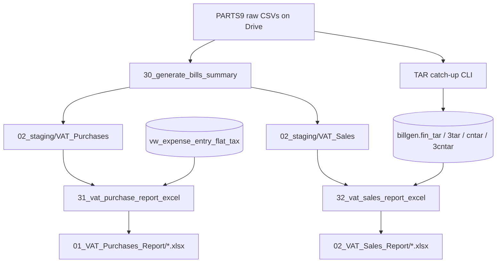

# VAT sales & purchase reports

Rules for the monthly Thai VAT tax books (รายงานภาษีขาย / รายงานภาษีซื้อ). Generated by HQ Task Scheduler notebooks; Excel only (no web UI). Useful reference for **kcw-v2** BI when surfacing or explaining these outputs.

**Canonical dictionary:** [kcw-vat-data-dictionary.md](https://github.com/pthengtr/kcw-docs/blob/main/dictionaries/kcw-vat-data-dictionary.md).

## Pipeline

Scheduled by [`worker_tasks/run_hq_parts9_full_pipeline.bat`](../worker_tasks/run_hq_parts9_full_pipeline.bat):

```
PARTS9 raw CSVs (Drive 01_raw / curated)
  → 30_generate_bills_summary.ipynb     # staging CSVs
  → TAR catch-up (CLI / notebook 21)    # billgen.fin_* for sales
  → 31_vat_purchase_report_excel.ipynb  # ภาษีซื้อ Excel
  → 32_vat_sales_report_excel.ipynb     # ภาษีขาย Excel
```

| Step | Notebook / code | Role |
|------|-----------------|------|
| Staging | `notebooks/30_generate_bills_summary.ipynb` | Monthly bill summaries → `02_staging/VAT_*` |
| Purchase Excel | `notebooks/31_vat_purchase_report_excel.ipynb` | Purchase books + expense VAT |
| Sales Excel | `notebooks/32_vat_sales_report_excel.ipynb` | Staging docs + TAR/CNTAR |
| Line filters (shared) | `src/kcw/utils.py` | `get_vat_sales_lines`, `get_vat_purchase_lines`, TAXIC helpers |
| TAR upstream | `src/kcw/tar.py` + `python -m src.kcw.pipeline tar --catch-up` | Fills `billgen.fin_*` |

Related (not the formal tax books): `20_vat_sales_nonvat_purchase_report.ipynb` — VAT sales whose last purchase was non-VAT → RV PDF/CSV.

## Reporting month

Same convention as bank statement Excel:

- Timezone: **Asia/Bangkok**
- Month = calendar month of **today − 10 days**
- Thai Buddhist Era dates in Excel (`CE year + 543`)

## Tax rate

**7%** everywhere (`tax_rate = 0.07`, divisor `1.07`).

### TAXIC (inclusive vs exclusive)

Used in staging (`30_`) for sales and purchase line totals:

| `TAXIC` | Meaning | Before VAT | VAT |
|---------|---------|------------|-----|
| `Y` | Amount **includes** VAT | `TOTAL / 1.07` | `TOTAL − BEFORE_VAT` |
| else | Amount **excludes** VAT | `TOTAL` | `TOTAL * 0.07` |

Purchase Excel prefers PIMAS header fields when present: `BEFORETAX`, `TAX`, `AFTERTAX` (renamed to Thai columns).

TAR / CNTAR lines in sales Excel always treat amount as **VAT-inclusive** (`TOTAL / 1.07`).

---

## Staging rules (`30_generate_bills_summary`)

### Sales → `02_staging/VAT_Sales/{YYYY_MM}/`

**Sources:** `raw_{hq\|syp}_sidet_sales_lines.csv` + SIMAS headers + ARMAS.

**Filters:**

1. Calendar year/month of reporting month
2. Drop bills whose `BILLNO` contains `TF`
3. Split by bill prefix, then summarize per bill (`build_bill_summary_by_taxic`)
4. `DETAIL` (รายการสินค้า) comes from the line with the largest `|AMOUNT|`. Credit-note lines are negative, so algebraic `idxmax` would pick the smallest credit.
5. Enrich from SIMAS (`ACCTNO`, `ACCTNAME`, tax fields, `PO`, …) and ARMAS `MOBILE`

| Site | Doc type | Bill prefixes | Staging file |
|------|----------|---------------|--------------|
| HQ | TD / TAD / TR / CN | `TD`, `TAD`, `TR`, `CN` | `TD.csv`, `TAD.csv`, `TR.csv`, `CN.csv` |
| SYP | same logical types | `3TD`, `3TAD`, `3TR`, `3CN` | `3TD.csv`, … |

### Purchases → `02_staging/VAT_Purchases/{YYYY_MM}/`

**Sources:** `raw_hq_pidet_purchase_lines.csv` ⋈ `raw_hq_pimas_purchase_bills.csv` (purchases are HQ-only in PARTS9).

**Filters:**

1. Calendar year/month
2. Keep `ISVAT == "Y"` only
3. Summarize per bill; group export by `BOOKNO`

| BOOKNO | Staging file pattern | Excel sheet (HQ) |
|--------|----------------------|------------------|
| `1` / `1_0` | `VAT_PURCHASE_{Y}_{MM}_BOOK_1_0.csv` | เครดิต |
| `2` | `…_BOOK_2_0.csv` | สด |
| `5` | `…_BOOK_5_0.csv` | ลดหนี้ซื้อ |
| `6` | `…_BOOK_6_0.csv` | เพิ่มหนี้ซื้อ |
| missing / other | `…_BOOK_UNKNOWN.csv` | Unknown |

---

## VAT purchase report (`31_`)

### Data inputs

1. Staging book CSVs above
2. Expense VAT from Supabase:

```sql
SELECT *
FROM vw_expense_entry_flat_tax
WHERE created_at >= DATE '{YEAR}-{MONTH}-10'
  AND created_at <= (DATE '{YEAR}-{MONTH}-10' + INTERVAL '1 month');
```

### Expense rules

1. Keep rows where `vat != 0`
2. Aggregate per `receipt_uuid` (`summarize_expense_receipts`)
3. Split `doc_type`:
   - `RECEIPT` → ค่าใช้จ่าย / Expense Receipt
   - `CREDIT_NOTE` → ลดหนี้ค่าใช้จ่าย / Expense Credit Note
4. Amounts (base treated as exclusive of VAT):

```text
vat_amount = signed_entry_amount * 0.07
after_vat  = signed_entry_amount * 1.07
```

5. Branch split: HQ if `branch_uuid == c93efb5f-07c9-4229-b6b3-568ce1c0a9ab`, else SYP

### Outputs

| File | Sheets |
|------|--------|
| `04_outputs/01_VAT_Purchases_Report/vat_purchases_report_{YYYY}_{MM}_hq.xlsx` | เครดิต, สด, ลดหนี้ซื้อ, เพิ่มหนี้ซื้อ, Unknown, ค่าใช้จ่าย, ลดหนี้ค่าใช้จ่าย, รวม |
| `…_syp.xlsx` | Expense Receipt, Expense Credit Note, รวม (skipped if empty) |

Purchase book columns use PIMAS tax fields (`BEFORETAX` / `TAX` / `AFTERTAX` → มูลค่าสินค้า / ภาษีมูลค่าเพิ่ม / ยอดสุทธิ).

---

## VAT sales report (`32_`)

### Data inputs

1. Staging `VAT_Sales` CSVs (TD/TAD/TR/CN + SYP `3*`)
2. CN split: bills starting with `CNTAD` / `3CNTAD` go to separate CNTAD sheet
3. TAR / CNTAR from Supabase (year/month of `billdate`):

| Table | Site sheet |
|-------|------------|
| `billgen.fin_tar_lines` | TAR |
| `billgen.fin_3tar_lines` | 3TAR |
| `billgen.fin_cntar_lines` | CNTAR |
| `billgen.fin_3cntar_lines` | 3CNTAR |

### TAR amount rule

Always inclusive:

```text
BEFORE_VAT = round(TOTAL_AMOUNT / 1.07, 2)
VAT_AMOUNT = round(TOTAL_AMOUNT - BEFORE_VAT, 2)
```

### Outputs

| File | Notable sheets |
|------|----------------|
| `04_outputs/02_VAT_Sales_Report/vat_sales_report_{YYYY}_{MM}_hq.xlsx` | TAR, CNTAR, TD, TR, TAD, CN, CNTAD, TAR/CNTAR (รายวัน), สรุป TAR CNTAR (รายวัน), รวม |
| `…_syp.xlsx` | 3TAR, 3CNTAR, 3TD, 3TR, 3TAD, 3CN, daily rollups, รวม |

Daily sheets roll up bill totals by date; the combined daily summary pairs TAR sales with CNTAR returns per day.

### Company headers (Excel)

| Branch | Name | Tax ID |
|--------|------|--------|
| HQ (สำนักงานใหญ่) | บริษัท เกียรติชัยอะไหล่ยนต์ 2007 จำกัด (สำนักงานใหญ่) | `0215560000262` |
| SYP (สาขา 00003) | … (สาขาที่ 00003) | same |

---

## Shared line filters (`src/kcw/utils.py`)

Used by inventory / TAR / notebook 20 more than by the formal Excel books:

| Function | Rule |
|----------|------|
| `get_vat_sales_lines` | `ISVAT=Y`, not canceled, year[/month] from SIDET |
| `get_vat_purchase_lines` | `ISVAT=Y`, year[/month] from PIDET |
| `remove_vat_inclusive` | if `TAXIC=Y` → `amount / 1.07` |
| `get_vat_sales_lines_last_purchase_nonvat` | VAT sale whose latest purchase was non-VAT (feeds RV) |
| `get_nonvat_sales_lines_last_purchase_vat` | NON-VAT sale whose latest purchase was VAT (feeds TAR) |

---

## Flow diagram



## Implementation pointers

- Do **not** reimplement VAT math in kcw-v2; consume Excel outputs or curated/Supabase facts when available.
- Expense view `vw_expense_entry_flat_tax` is not defined in this repo’s migrations — lives in the shared Supabase project.
- TAR numbering and catch-up semantics: see root [`README.md`](../README.md) (TAR catch-up section) and `src/kcw/tar.py`.
